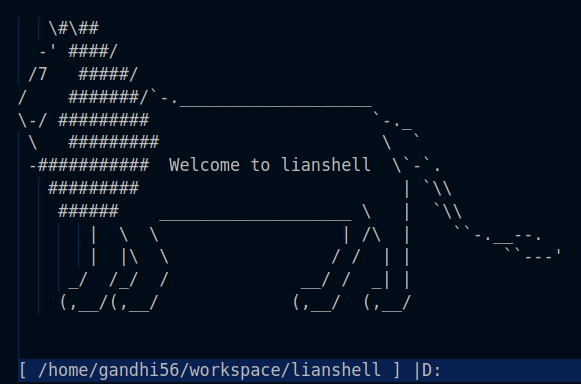

# LiAnshEll

## Project description
LiAnshEll is a standalone procedurally designed UNIX-based shell program that supports the following features:
1. Support for built-in commands including:
    * changing working directory
    * modifying environment variables
    * killing all subprocesses
2. Runs external programs from any specified location in the file system
3. Sequential execution of multiple processes
4. Redirection of output from a process to a file
5. Run processes in the background
6. Implement piping of output from one program to another
7. Handles signal interrupts, including SIGINT and SIGTSTP.

## Issues
1. More signal handling
2. Auto-completion of commands
3. Use ncurses
4. TERM environment variable needs to be set

## System calls used
* chdir()   :   to change working directory
* fork()    :   to create a subprocess
* execve()  :   to execute a process
* _exit()   :   to exit a process
* wait()    :   to wait for a process to terminate
* open() / close()  :   to open or close a file descriptor
* dup2()    :   duplicate a file descriptor to another
* pipe()    :   establish a pipe between two processes
* kill()    :   send a signal to a process

## Testing procedure
LiAnshEll was tested by running various commands individually as well as in combination with other commands. Valgrind was used to test for memory leaks in the heap and stack memory. htop and pstree were also used to maintain subprocess construction and destruction.

## References
* StackOverFlow
* TutorialsPoint
* eclass CMPUT 379 slides and lab examples
